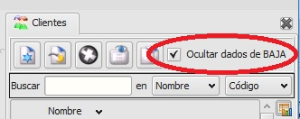

====================================================
Añade una casilla de selección en el master de clientes del módulo de Principal de Facturación para ocultar los clientes dados de baja.
====================================================

Añade una casilla de selección en el master de clientes del módulo de Principal de Facturación para ocultar los clientes dados de baja.

Extensión creada por Miguel-J. Visita:

http://manuales-eneboo-pineboo.org

---------------------
Módulos que necesitan estar instalados previamente
---------------------

    * "facturacion/principal" name="flfactppal"
   

---------------------
Extensiones que necesitan estar instaladas previamente
---------------------

   * Ninguna

---------------------
Capturas de pantalla
---------------------

   
   Tabla de clientes con filtro.
   
------
